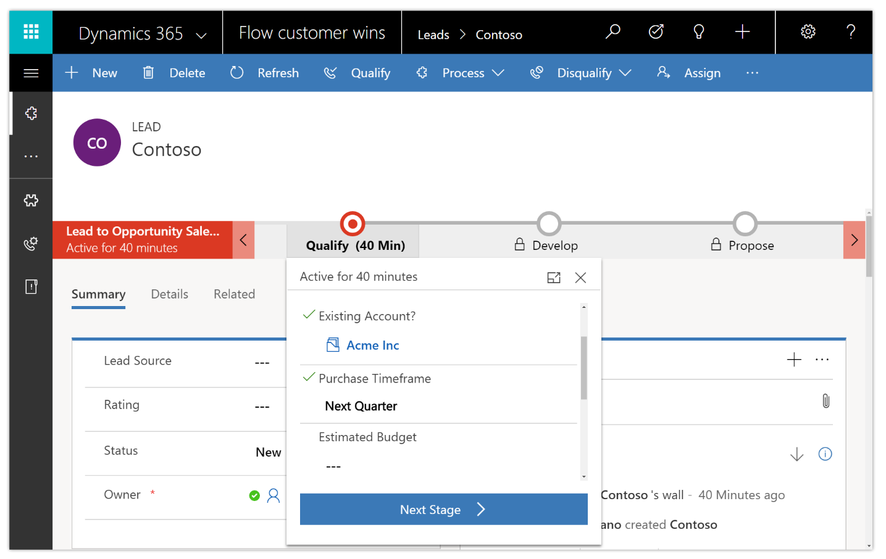

---

title: Create a business process flow
description: Use business process flows to define a set of steps for people to follow to take them to a desired outcome.
author: MargoC
manager: AnnBe
ms.date: 4/30/2018
ms.topic: article
ms.prod: 
ms.service: business-applications
ms.technology: 
ms.author: margoc
audience: Admin

---
#  Create a business process flow

[!include[banner](../../../includes/banner.md)]

Use business process flows to define a set of steps for people to follow to take
them to a desired outcome. You can configure business process flows to support
common sales methodologies that can help your sales groups achieve better
results. For service groups, business process flows can help new staff get up to
speed more quickly and avoid mistakes that could result in unsatisfied
customers.

With business process flows, you define a set of stages and steps that people go
through.

<!-- Picture 14 -->

*Business process flow*

Each stage contains a group of steps. Each step represents a field where data
can be entered. People advance to the next stage by using the Next Stage button.
You can make a step required, so that people must enter data for the
corresponding field before they can proceed to the next stage. This is commonly
called “stage-gating.” In addition, you can call workflows from inside a
business process flow.

Access business processes by selecting Processes in the Flow portal. From there,
you can create new business process flows and monitor existing business process
flows.

[For more information about business process flows, go to Create a business
process flow to standardize
processes.](https://docs.microsoft.com/en-us/dynamics365/customer-engagement/customize/create-business-process-flow)
