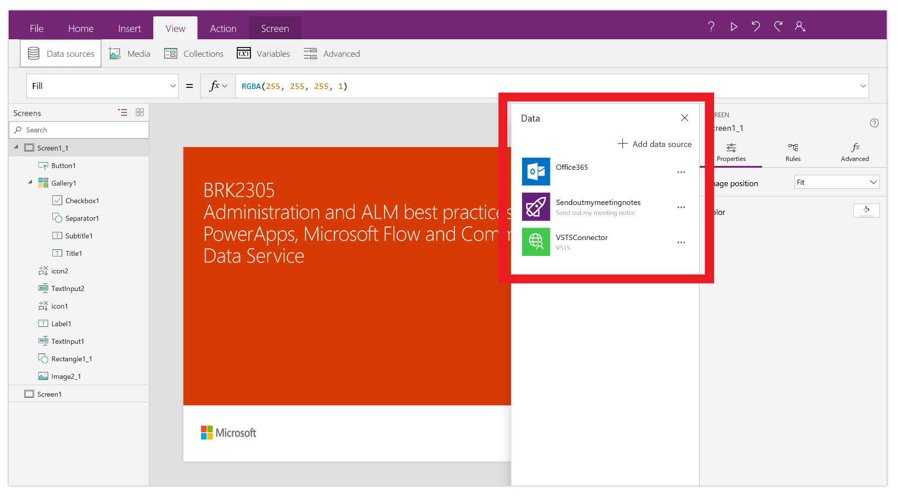

---

title: GDPR compliance
description: GDPR compliance
author: MargoC
manager: AnnBe
ms.date: 4/30/2018
ms.topic: article
ms.prod: 
ms.service: business-applications
ms.technology: 
ms.author: margoc
audience: Admin

---
#  GDPR compliance

[!include[banner](../../../includes/banner.md)]

Microsoft is committed to General Data Protection Regulation (GDPR) compliance
across our cloud services, including PowerApps. When a user is deleted from
Azure Active Directory (AAD), the tenant administrator receives an email
notification indicating that the user has been deleted from the corporate
directory.

At that point, the admin can determine which apps were previously owned by the
user and reassign ownership of those apps by using [PowerShell admin
cmdlets](https://powerapps.microsoft.com/blog/). The admin can optionally delete
the applications if they are no longer in use within the organization.

The newly assigned app owner can view, rename, edit, or delete the application.
When a user is deleted from Azure Active Directory, if the app relied on any
connections that were created by the user (such as connections to a Customer
Connector, SQL Server, and so on), the app will be broken until the new owner
takes the following steps:

1.  Re-create the required connections.

2.  In PowerApps Studio, update the app to point to those new connections.

3.  Save and publish the application.

<!-- Picture 11 -->

Update connections

Go to the Trust Center to learn more about GDPR and find resources to help you
comply.

